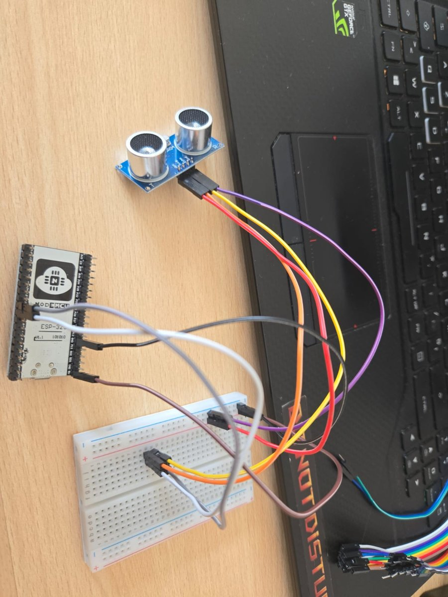
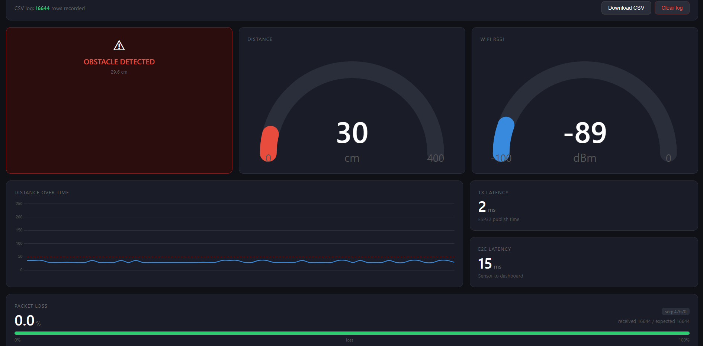
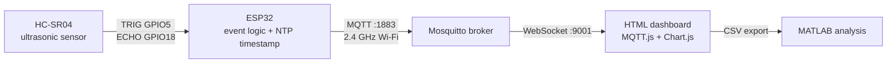
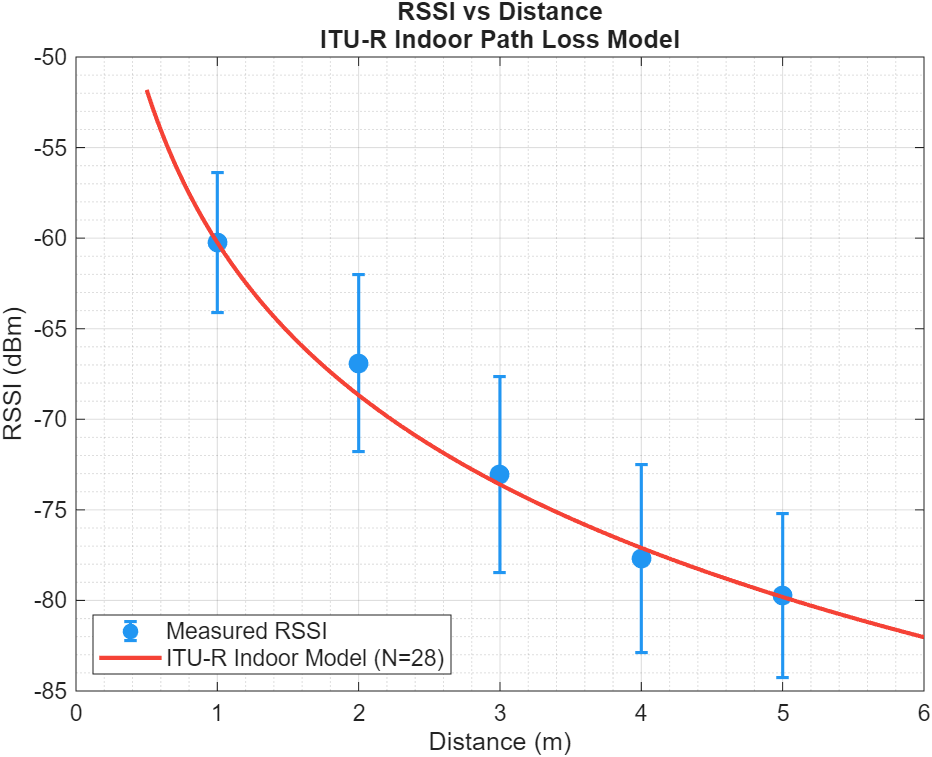
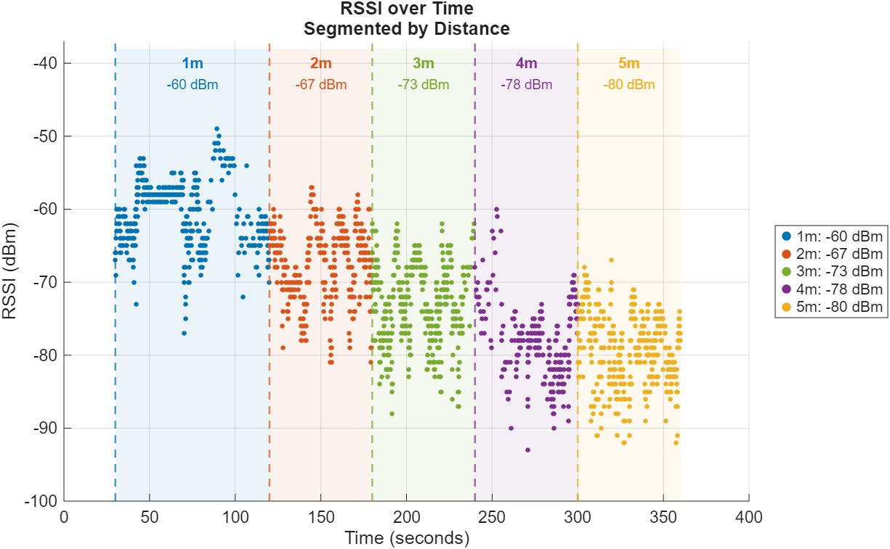
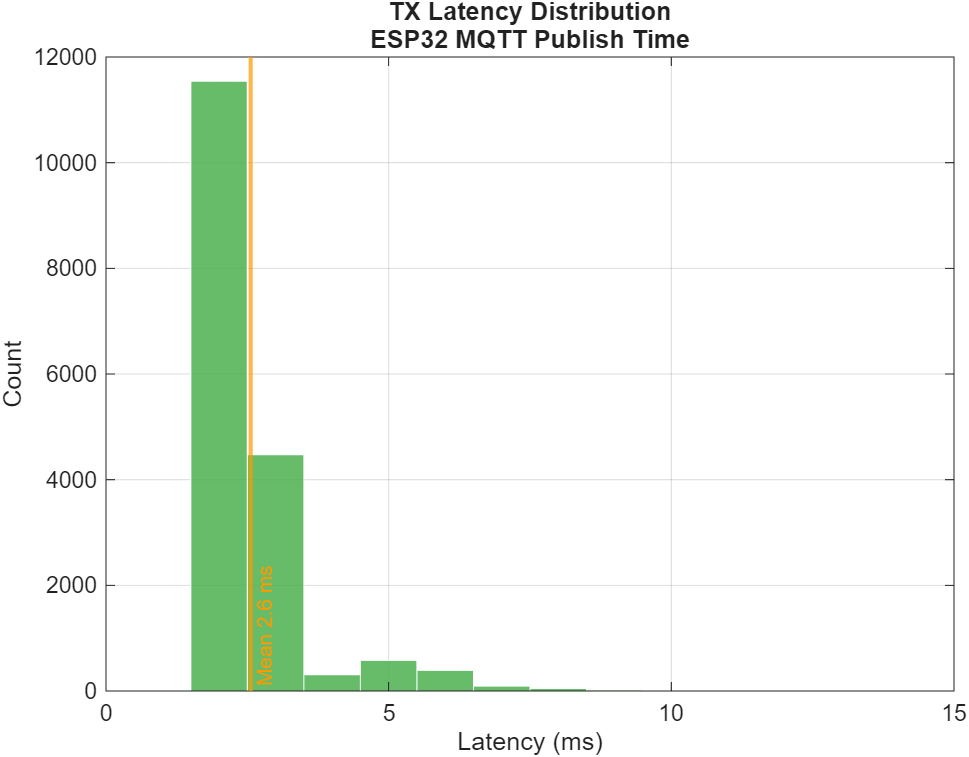

<div align="center">

# 📡 Wireless IIoT Proximity Sensing Node

**ESP32 + HC-SR04 proximity node publishing over MQTT on 2.4 GHz Wi-Fi, with a live WebSocket dashboard and an indoor path-loss & latency measurement campaign**


*Industrial Communications & IIoT — University of L'Aquila · 2025/2026*

[Overview](#-overview) · [Architecture](#%EF%B8%8F-architecture) · [Results](#-results) · [Limitations](#%EF%B8%8F-known-limitations) · [Getting started](#-getting-started)

</div>

---

## 🔎 Overview

A proximity sensor node for an industrial safety scenario: it detects when a vehicle or obstacle gets too close to a machine and reports it to a SCADA-style supervisory dashboard over Wi-Fi.

The focus is the **wireless communication layer** — how the 2.4 GHz indoor channel attenuates with distance, and how fast and reliably MQTT delivers sensor data.

<div align="center">
  
  &nbsp;
  
  <br/>
  <sub><i>Left: ESP32 + HC-SR04 ultrasonic sensor · Right: live WebSocket dashboard</i></sub>
</div>

### ✨ Features

| | Feature | Details |
|---|---|---|
| ⚡ | **Event-driven transmission** | Publishes only when distance changes by > 5 cm, or on every cycle inside the 30 cm safety zone |
| 🔁 | **Publish retry** | Failed `publish()` calls are retried once and counted on a dedicated topic |
| 🔢 | **Sequence numbers** | Every message carries a sequence number; the dashboard detects gaps as packet loss |
| 🕒 | **NTP timestamps** | Payloads carry a Unix-ms timestamp for end-to-end latency (see [limitations](#%EF%B8%8F-known-limitations)) |
| 🖥️ | **Direct WebSocket dashboard** | Browser connects straight to Mosquitto (no Node-RED layer), with CSV export |
| 📶 | **Path-loss analysis** | Measured RSSI at 1–5 m compared with the ITU-R indoor model in MATLAB |

---

## 🏗️ Architecture



Mapped to the IIoT layers: **field** (sensor + ESP32) → **communication** (Wi-Fi + MQTT) → **supervisory** (dashboard as HMI).

### MQTT topics

| Topic | Payload |
|---|---|
| `iiot/node1/distance` | `distance_cm,unix_ms,seq` |
| `iiot/node1/rssi` | RSSI in dBm |
| `iiot/node1/latency` | TX latency in ms (time to complete the publish calls) |
| `iiot/node1/seq` | sequence number |
| `iiot/node1/retransmissions` | cumulative failed-publish counter |

---

## 📈 Results

All numbers below are computed from [`analysis/data/`](analysis/data) with [`iiot_analysis.m`](analysis/iiot_analysis.m).

### Path loss — measurements match the ITU-R indoor model

The Wi-Fi hotspot was moved from 1 m to 5 m while the node logged RSSI continuously (moved ±10–20 cm at each position to average out multipath).

<div align="center">
  
  
</div>

| Distance | Mean RSSI | Std dev | Samples | ITU-R model (N = 28) |
|:-:|:-:|:-:|:-:|:-:|
| 1 m | −60.2 dBm | 3.9 dB | 4763 | −60.2 dBm *(anchor)* |
| 2 m | −66.9 dBm | 4.9 dB | 1358 | −68.6 dBm |
| 3 m | −73.0 dBm | 5.4 dB | 4663 | −73.6 dBm |
| 4 m | −77.7 dBm | 5.2 dB | 439 | −77.1 dBm |
| 5 m | −79.7 dBm | 4.5 dB | 3396 | −79.8 dBm |

> 💡 Fitting the distance coefficient to the data gives **N ≈ 27.6**, within 0.4 of the ITU-R value of 28 for 2.4 GHz indoors. Every measured point is within 1.7 dB of the model. The 4–5 dB standard deviation reflects multipath fading.

### TX latency

<div align="center">
  
</div>

| Metric | Value |
|---|---|
| Mean | 3.3 ms |
| Median | 2 ms |
| Under 5 ms | 93.2 % |
| Under 10 ms | 99.7 % |
| Outliers ≥ 10 ms | 58 of 17 510 (max 2.4 s) |

TX latency is the time the ESP32 spends inside the `publish()` calls — i.e. handing data to the TCP stack, not over-the-air delivery.

### Packet loss

**0.0 %** at the application layer across the whole session (no gaps in sequence numbers). This is expected: MQTT runs over TCP, which retransmits lost frames before they reach the application — so packet loss alone says little about channel quality.

---

## ⚠️ Known limitations

Documented honestly so the results can be interpreted correctly:

- **End-to-end latency is not reportable from this dataset.** 98 % of logged E2E values are negative (median −170 ms), meaning the ESP32 and PC clocks were offset by more than the latency itself. NTP on the ESP32 and default Windows time sync are not accurate enough for millisecond one-way measurements. The dashboard only displays positive values, which hid this during the live session.
- **The dataset was recorded with the earlier fixed-rate stress-test firmware** (publish interval down to ~10 ms). The firmware in `src/` is the later event-driven version (100 ms check interval, publishes on change).
- **Single environment, single session** — one indoor room, line of sight, phone hotspot as access point.

### 🔭 Next steps
- Measure **round-trip time** instead of one-way latency: the dashboard echoes each message back and the ESP32 times it with its own clock — no clock sync needed.
- Re-record the campaign with the event-driven firmware.
- Correlate RSSI with RTT to quantify how a weak link delays delivery even with 0 % packet loss.

---

## 🚀 Getting started

### Hardware
| HC-SR04 | ESP32 |
|---|---|
| VCC | 5V |
| GND | GND |
| TRIG | GPIO 5 |
| ECHO | GPIO 18 |

### 1. Configure credentials
```bash
cp include/secrets.example.h include/secrets.h
# edit include/secrets.h: Wi-Fi SSID, password, broker IP
```

### 2. Run Mosquitto with a WebSocket listener
`mosquitto.conf`:
```conf
listener 1883
listener 9001
protocol websockets
allow_anonymous true
```
```bash
mosquitto -c mosquitto.conf -v
```
> `allow_anonymous true` is for a local test network only.

### 3. Flash the ESP32
```bash
pio run --target upload
pio device monitor
```

### 4. Open the dashboard
Open `dashboard/index.html` in a browser. It connects to `ws://localhost:9001`.

### 5. Analyse
Open MATLAB in `analysis/` and run `iiot_analysis.m`. It regenerates the three plots.

---

## 📁 Repository structure

```
├── src/main.cpp             ESP32 firmware (event-driven, NTP, retry, sequence numbers)
├── include/                 secrets.example.h (copy to secrets.h)
├── dashboard/index.html     Live WebSocket dashboard with CSV export
├── analysis/
│   ├── iiot_analysis.m      Path-loss + latency analysis
│   └── data/                Measurement CSV (27 June 2026 session)
├── docs/                    Photos and plots
└── platformio.ini
```

---

## 👩‍💻 Author

**Selma Ben Sassi** — M.Sc. Telecommunications Engineering (Digital Health), University of L'Aquila

[](https://linkedin.com/in/selma-ben-sassi)
[](https://github.com/selmabensassi)

<sub>Course: Industrial Communications & IIoT — Prof. P. Di Marco, Prof. Y. Zacchia Lun</sub>
